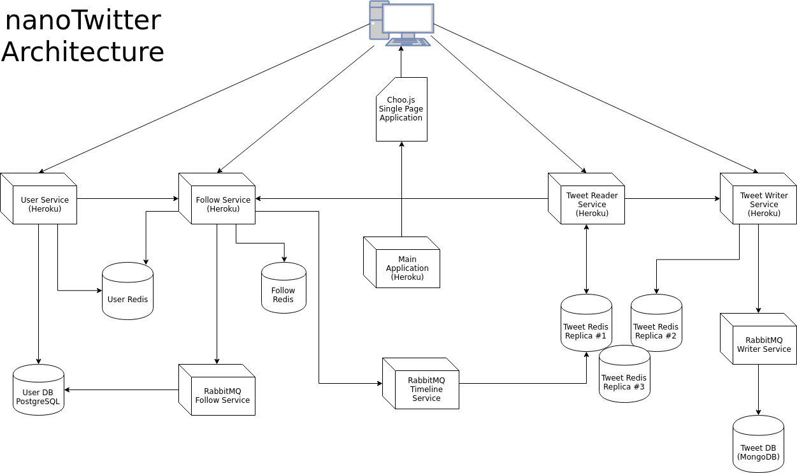

# nanotwitter
Our Git repository for our CS105b project.
---------------

## Portfolio Page
https://fantastic-four124.github.io/index.html

## Important Notes
Our front-end uses Choo.js and is a single-page web application. For this reason, the function of the "nanotwitter-main" application is simply to deliver the bundle.js. The app renders views on its own and communicates with the microservices in order to get data. Unit tests can be found in each of the microservice folders.

You may view the front-end Choo.js JavaScript application in the nt-choo directory.

One purpose of this application is to let you test the app locally, without using NPM or JavaScript. You can run "ruby service.rb" to start the application, although what it really is doing is loading the JavaScript bundle into your browser.

Another thing is that services may not work properly unless the services are "woken up." In particular, the RabbitMQ services currently do not work properly unless you attempt to open them, and they fall asleep rather quickly. If the app is not behaving as expected, please open the following URLs to "wake up the bunnies":

- https://nt-rabbit-timeline.herokuapp.com
- https://nt-rabbit-writer.herokuapp.com
- https://nt-rabbitmq-follow.herokuapp.com

There also is an intermittent rendering bug if you "refresh" the page. If the page appears to go "blank", try going to '/' and refreshing it again a few times.

## Change History
---------------
### Version 0.1
The following was added to version 0.1:
- [x] GitHub repository initialized under the organization name "FantasticFour-124." *(Performed by Cameron Cho)*

- [x] Database design was determined. At the moment, there are models for Users, Tweets, Mentions and Hashtags. *(Performed as a team)*

- [x] Routing of pages was determined. *(Performed as a team)*

- [x] Mockups for User Interface have been created. *(Performed by Tom Willkens)*

### Version 0.2
The following was added to version 0.2:
- [x] Sinatra skeleton application for nanoTwitter constructed. Currently using Activerecord, but are considering the use of MongoDB. *(Performed by Cameron Cho)*

- [x] Migrations for Users, Tweets, Mentions and Hashtags created. *(Performed by Zhengyang Zhou)*

- [x] VERY basic authentication put in place. Needs to be tested. *(Performed by Cameron Cho)*

- [x] Project deployed on Heroku. *(Performed by Alex Hu)*

- [x] Registration function is on. *(Performed by Zhengyang Zhou)*

### Version 0.3
The following was added to version 0.3:
- [x] Codeship account created for nanoTwitter project. It has also been set to autodeploy to Heroku whenever a team member pushes to GitHub. *(Performed by Cameron Cho)*

- [x] Testing suite constructed with MiniTest. *(Performed by Alex Hu and Cameron Cho)*

- [x] Testing interface constructed. *(Performed by Alex Hu)*

- [x] Seed data for testing retrieved. *(Performed by Tom Willkens and Cameron Cho)*

- [x] Work on using GraphQL started. *(Performed by Tom Willkens)*

- [x] Study on RabbitMQ and Redis started. *(Performed by Zhengyang Zhou)*

- [x] Study and implementation of MongoDB and Mongoid started. *(Performed by Cameron Cho)*

### Version 0.4
The following was added to version 0.4:
 - [x] An account to loader.io was created and the pilot tests were run. *(Performed by Cameron Cho)*

 - [x] Added more tests to flesh out interface and Minitest suite. *(Performed by Tom Willkens and Zhengyang Zhou)*

 - [x] Test driven development was employed to complete the testing interface. *(Performed by Alex Hu)*

 - [x] All members decided to log into nanoTwitter to start Tweeting and test it manually. *(Performed by everyone)*

 - [x] Discussion on services started. *(Performed by everyone)*

### Version 0.5
The following was added to version 0.5:
 - [x] A series of client-load tests (including sustained load) were performed. The tests suggest odd behavior concerning Redis, since it did not seem to alleviate much load. However,  *(Performed by Tom Willkens)*
 
 - [x] We installed New Relic to our main application. We still need New Relic on our services. *(Performed by Cameron Cho and Tom Willkens)*
 
 - [x] Started switching from WebBrick/Heroku to Elastic Beanstalk on Amazon. *(Performed by Tom Willkens)*
 
 - [x] Added an index for our schema, particularly for users and the user/follower system. *(Performed by Zhengyang Zhou)*

### Version 0.6

- [x] We had starting working with Redis servers as of Version 0.4. *(Performed by Zhengyang Zhou)*

- [x] We implemented tests with Redis. *(Performed by Tom Willkens and Zhengyang Zhou)*

- [x] We used loader.io for scalability tests on the main application and the services. *(Performed by everyone)*

- [x] Started building follow service *(Alex)*

- [x] Started building tweet service *(Cam)*

Links to the tests:
 - Redis on Mongo Monolith, 100 client maintained load: https://ldr.io/2ILHqqk
 - Redis Mongo Test - Monolith - 250 client maintained load: https://ldr.io/2GTTODP
 - Make one user follow another one - 100 client maintained load: https://ldr.io/2HuzbPZ
 - Hack Cache 100 Users: Monolith https://ldr.io/2GTAN8N
 - Hack Chacke 250 Users Monolith: https://ldr.io/2qwczGO
 - Mongo Basic Monolith Recents Tweets 100 Users: https://ldr.io/2GUv6aK
 - Mongo Basic Monolith Recent Tweets 250 Users: https://ldr.io/2JHuNxx
 - Test-login-with-follow-100:  https://ldr.io/2IL3Mba
 - Test-login-with-follow-500:  https://ldr.io/2IOJOMM
 - Test-register-random-data-500-1min:  https://ldr.io/2JEnC9o
 - Test-register-random-data-100-1min: https://ldr.io/2GSyClK
 - Basic Maintained Load on Recent Tweets (no Redis, 500 users, 1 minute): https://ldr.io/2IOD41q
 - Basic Maintained Load on Recent Tweets (no Redis, 100 users, 20 seconds): https://ldr.io/2IOkUgd
 - Choo Elastic Beanstalk Bundle.js Only: https://ldr.io/2ILKRNK
 - Choo Elastic Beanstalk Bundle + Get Recent Tweets: https://ldr.io/2JCjAyh
 - Choo Elastic Beanstalk Maintain Load 100 Users: https://ldr.io/2INc826
 - Choo Elastic Beanstalk Maintain Load 500 Users: https://ldr.io/2JDAhtr
 
 > A note on the follow tests from Alex: "I used RabbitMQ for interprocess communication. There is another thread constantly reading the queue and save it to db. However, the test result doesn't reflect the benefit from multi-threading. We will look into that."
 
 The reason is client got initialized everytime. During initilization of the client, channels are estabilished. Therefore, we eventaully made the client as a global veriable.  *(Alex)*
 
 
### Version 0.7

- [x] Implementation of Choo front end *(Performed by Tom Willkens)*
- [x] Implementaiion of Timeline *(Performed by Zhengyang Zhou)*

### Version 0.8 
- [x] INTERGRATION! Getting all servicecs coordinate. *(Performed by everyone)*
- [x] Test interface with microservices  *(Performed by Alex)*
- [x] Profolio page  *(Performed by Cam)*
- [x] Tweet writing service with RabbitMQ *(Performed by Zhengyang Zhou)*
- [x] Follow writing service with RabbitMQ *(Performed by Alex)*
- [x] Wrote unit tests. *(Performed by everyone)*

### Version 0.9, 1.0
- [x] Finalize everything *(Performed by everyone)*
- [x] Switched front end from AWS to heroku. *(Performed by Tom Willkens)*
- [x] Optimized the bundle model for loading tests (cached the whole bundle) *(Performed by Tom Willkens and Zhengyang Zhou)*

## CODE CLIMATE

For eb-nanotwitter-main:
Maintainability Badge: <a href="https://codeclimate.com/github/Fantastic-Four124/eb-nanotwitter-main/maintainability%22%3E</a>

Testing Badge: <a href="https://codeclimate.com/github/Fantastic-Four124/eb-nanotwitter-main/test_coverage%22%3E</a>
----
For nanotwitter-follow-service:
Maintainability: <a href="https://codeclimate.com/github/Fantastic-Four124/nanotwitter-follow-service/maintainability%22%3E</a>

Testing: <a href="https://codeclimate.com/github/Fantastic-Four124/nanotwitter-follow-service/test_coverage%22%3E</a>
----
For nanotwitter rabbit for follows:
Maintainability: <a href="https://codeclimate.com/github/Fantastic-Four124/nt-rabbitmq-follow-Open-app-More-/maintainability%22%3E</a>

Testing: <a href="https://codeclimate.com/github/Fantastic-Four124/nt-rabbitmq-follow-Open-app-More-/test_coverage%22%3E</a>
----
For rabbit timeline:
Maintainability: <a href="https://codeclimate.com/github/Fantastic-Four124/nt-rabbit-timeline/maintainability%22%3E</a>

Testing: <a href="https://codeclimate.com/github/Fantastic-Four124/nt-rabbit-timeline/test_coverage%22%3E</a>
----
For rabbit writer:
Maintainability: <a href="https://codeclimate.com/github/Fantastic-Four124/nt-rabbit-writer/maintainability%22%3E</a>

Testing: <a href="https://codeclimate.com/github/Fantastic-Four124/nt-rabbit-writer/test_coverage%22%3E</a>
----
For tweet-reader:
Maintainability: <a href="https://codeclimate.com/github/Fantastic-Four124/tweet-reader/maintainability%22%3E</a>

Testing: <a href="https://codeclimate.com/github/Fantastic-Four124/tweet-reader/test_coverage%22%3E</a>
----
For Tweet-writer:
Maintainability: <a href="https://codeclimate.com/github/Fantastic-Four124/tweet-writer/maintainability%22%3E</a>

Testing: <a href="https://codeclimate.com/github/Fantastic-Four124/tweet-writer/test_coverage%22%3E</a>
----
For userservice:
Maintainability: <a href="https://codeclimate.com/github/Fantastic-Four124/userservice/maintainability%22%3E</a>

Testing:  <a href="https://codeclimate.com/github/Fantastic-Four124/userservice/test_coverage%22%3E</a>

